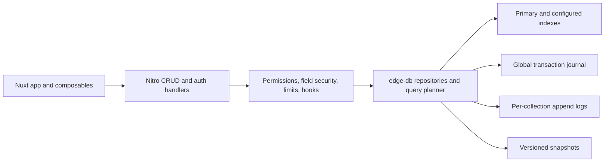

# Agile Nuxt Edge Backend

[](https://github.com/agile-nuxt/agile-nuxt-edge-backend/actions/workflows/ci.yml)
[](https://www.npmjs.com/package/@agile-nuxt/edge-db)
[](https://www.npmjs.com/package/@agile-nuxt/backend)
[](./LICENSE)

> A zero-setup, pure TypeScript embedded database and secure backend service for Nuxt/Nitro apps.

This monorepo contains two packages:

- `@agile-nuxt/edge-db`: an embedded, schema-driven document database with append-only logs, indexes, transactions, snapshots, recovery, compaction, diagnostics, and backups.
- `@agile-nuxt/backend`: a Nuxt 4/Nitro module that adds explicitly permitted CRUD routes, optional hardened auth, field security, rate limits, hooks, composables, and server utilities.

It exists for small-to-medium business applications that need fast indexed CRUD without native modules or an external database service. It is designed for one persistent Node.js server, including cPanel and VPS deployments.

| Package | Purpose |
| --- | --- |
| [`@agile-nuxt/edge-db`](./packages/edge-db) | Embedded storage, queries, indexes, transactions, recovery, backup, and CLI. |
| [`@agile-nuxt/backend`](./packages/backend) | Nuxt module, Nitro CRUD/auth handlers, permissions, hooks, and composables. |

## Architecture



The packages are separate so `edge-db` can be used without HTTP or Nuxt, while `backend` remains a configurable integration layer.

## What It Is

- Pure TypeScript and Node.js standard-library storage.
- Fast indexed CRUD for schema-driven Nuxt/Nitro applications.
- Append-only, checksum-validated writes with committed transaction markers.
- Safe-by-default generic CRUD limited to configured entities and fields.
- Optional JWT access tokens and opaque, hashed, rotating refresh tokens.
- A cPanel-friendly option when a writable persistent filesystem is available.

## What It Is Not

Version 1 is not:

- a PostgreSQL replacement or SQL database;
- a multi-server or distributed write system;
- suitable for serverless or edge runtimes with ephemeral filesystems;
- an analytical/OLAP database;
- a PostgreSQL-style relational query or arbitrary join engine.

Relations are metadata helpers (`belongsTo`, `hasMany`) plus optional `ref` fields. V1 enforces `onDelete: restrict`; arbitrary joins and automatic includes are intentionally not implemented.

## Requirements

- Node.js 20 or newer.
- A writable **persistent** filesystem for writable mode.
- Exactly one writable Node process per database path.
- macOS or Linux for supported production deployments.

Writable boot rejects known serverless/edge environments. `readOnly: true` is available for inspection and controlled tooling, but does not make shared multi-server writes safe.

## Installation

```bash
pnpm add @agile-nuxt/edge-db @agile-nuxt/backend
```

## Nuxt Quick Start

```ts
export default defineNuxtConfig({
  modules: ['@agile-nuxt/backend'],
  nitro: { preset: 'node-server' },
  backend: {
    auth: false,
    db: {
      path: process.env.EDGE_DB_PATH || './storage/edge-db'
    },
    entities: {
      products: {
        fields: {
          id: 'id',
          title: 'text',
          price: 'integer',
          status: 'text.default:active',
          createdAt: 'datetime',
          updatedAt: 'datetime'
        },
        indexes: ['status', 'createdAt'],
        timestamps: true,
        api: true,
        permissions: {
          list: 'public',
          read: 'public',
          create: 'disabled',
          update: 'disabled',
          delete: 'disabled'
        }
      }
    }
  }
})
```

## GitHub-Only Quickstart Template

[`templates/agile-nuxt-fullstack`](./templates/agile-nuxt-fullstack) is a complete
English/LTR Nuxt app using both packages. It includes a working product CRUD
dashboard, auth-ready login form, responsive raw CSS, and cPanel deployment notes.

The template is intentionally **not published to npm**. Its package is private,
Changesets ignores it, and repository checks reject public publish configuration.

Inside this repository:

```bash
pnpm install
pnpm --filter agile-nuxt-fullstack dev
```

After copying it into a separate project:

```bash
pnpm add nuxt @agile-nuxt/edge-db @agile-nuxt/backend
pnpm dev
```

## Edge DB Quick Start

```ts
import {
  createDatabase,
  defineSchema,
  type InferSchema
} from '@agile-nuxt/edge-db'

const schema = defineSchema({
  users: {
    fields: {
      id: 'id',
      name: 'text',
      email: 'text.unique',
      passwordHash: 'text.private',
      role: 'text.default:user',
      createdAt: 'datetime',
      updatedAt: 'datetime'
    },
    indexes: ['email', 'role'],
    unique: ['email'],
    timestamps: true
  }
})

type AppData = InferSchema<typeof schema>

const db = createDatabase({
  path: './storage/edge-db',
  schema
})

await db.boot()
const user = await db.collection('users').create({
  name: 'Admin',
  email: 'admin@example.com',
  passwordHash: 'server-created-hash'
})
```

Normal reads strip private fields. Trusted server code can use the explicitly named `findByIdInternal` and `findFirstInternal` methods where access to private fields is required.

## Queries and Pagination

```ts
const page = await db.collection('users').findMany({
  where: {
    role: 'admin',
    createdAt: { gte: '2026-01-01T00:00:00.000Z' }
  },
  orderBy: { createdAt: 'desc' },
  limit: 20,
  cursor: undefined,
  select: ['id', 'name', 'email', 'role'],
  debug: true
})
```

Supported filters are `eq`, `ne`, `gt`, `gte`, `lt`, `lte`, `in`, `notIn`, `contains`, `startsWith`, `endsWith`, and `isNull`.

The planner prefers primary, unique, compound, then secondary indexes. Development emits structured warnings for scans and unindexed sorts, including a compound-index recommendation when useful. Production rejects expensive unindexed filters/sorts by default. Configure `query.allowUnindexedQueries: true` only after reviewing the dataset and workload.

Limits are enforced for result size, request body size, and `in`/`notIn` item counts.

## Transactions and Relations

```ts
await db.transaction(async (tx) => {
  const user = await tx.collection('users').create({ /* ... */ })
  await tx.collection('auditLogs').create({ userId: user.id, action: 'created' })
})
```

Cross-collection commits use per-collection append logs plus a root commit journal. Recovery applies only globally committed transactions.

```ts
userId: {
  type: 'text',
  ref: { collection: 'users', onDelete: 'restrict' }
}
```

## Nuxt Without Auth

```ts
export default defineNuxtConfig({
  modules: ['@agile-nuxt/backend'],
  nitro: { preset: 'node-server' },
  backend: {
    auth: false,
    db: { path: process.env.EDGE_DB_PATH || './storage/edge-db' },
    entities: {
      products: {
        fields: {
          id: 'id',
          title: 'text',
          price: 'integer',
          status: 'text.default:active',
          createdAt: 'datetime',
          updatedAt: 'datetime'
        },
        indexes: ['status', 'createdAt'],
        timestamps: true,
        api: true,
        permissions: {
          list: 'public',
          read: 'public',
          create: 'disabled',
          update: 'disabled',
          delete: 'disabled'
        }
      }
    }
  }
})
```

An entity is invisible unless `api: true`. Every unspecified action is disabled.

## Nuxt With Auth

```ts
export default defineNuxtConfig({
  modules: ['@agile-nuxt/backend'],
  backend: {
    auth: {
      enabled: true,
      accessTokenSecret: process.env.ACCESS_TOKEN_SECRET!,
      refreshTokenSecret: process.env.REFRESH_TOKEN_SECRET!,
      accessTokenMaxAge: '15m',
      refreshTokenMaxAge: '30d',
      cookieMode: true
    },
    db: { path: process.env.EDGE_DB_PATH || './storage/edge-db' },
    entities: {
      users: {
        fields: {
          id: 'id',
          email: 'text.unique',
          passwordHash: 'text.private',
          role: 'text.default:user',
          isActive: 'boolean.default:true',
          createdAt: 'datetime',
          updatedAt: 'datetime'
        },
        indexes: ['email', 'role'],
        unique: ['email'],
        timestamps: true,
        api: true,
        publicFields: ['id', 'email', 'role', 'isActive'],
        permissions: {
          list: ['admin'],
          read: ['admin', 'self'],
          create: ['admin'],
          update: ['admin', 'self'],
          delete: ['admin']
        }
      }
    }
  }
})
```

Secrets shorter than 32 bytes are rejected. Passwords use Node `scrypt`. Refresh tokens are random opaque values, stored only as hashes, revoked on use, and replaced. Cookie mode uses HTTP-only `SameSite=Strict` cookies and a CSRF header token.

## Generated APIs

- `GET /api/backend/:entity`
- `POST /api/backend/:entity`
- `POST /api/backend/:entity/query`
- `GET /api/backend/:entity/:id`
- `PATCH /api/backend/:entity/:id`
- `DELETE /api/backend/:entity/:id`
- `POST /api/backend/:entity/:id/restore`

Auth routes are registered only when auth is enabled:

- `POST /api/auth/register`
- `POST /api/auth/login`
- `POST /api/auth/refresh`
- `POST /api/auth/logout`
- `GET /api/auth/me`

## Composables and Custom Routes

```ts
const products = useBackendEntity('products')
const page = await products.list({ where: { status: 'active' }, limit: 20 })
```

For domain workflows that do not fit generic CRUD:

```ts
import {
  defineBackendHandler,
  requireAuth,
  useBackendDb
} from '@agile-nuxt/backend/server'

export default defineBackendHandler(async (event) => {
  const user = await requireAuth(event)
  const db = await useBackendDb()
  return db.transaction(async (tx) => {
    // Implement the domain-specific operation here.
  })
})
```

Also available: `getCurrentUser` and `requirePermission`.

## Storage and Crash Safety

```text
edge-db/
  manifest.json
  journal.ndjson
  lock
  archive/
  collections/
    users/
      schema.json
      snapshot-000123.json
      log-000002.ndjson
      archive/
```

Manifests, schemas, snapshots, and log records carry format versions. Log records include byte length and SHA-256 checksums. Writes are append-only and fsynced. Snapshots and manifests use temp files plus atomic rename.

Recovery loads the activated snapshot, validates checksums, and replays only committed records after its sequence. An incomplete or corrupt final log record is ignored and reported. Corruption before the tail stops boot instead of silently discarding valid history.

## Safe Backup and Restore

```ts
await db.backup('/srv/backups/app-2026-06-24')
await db.restore('/srv/backups/app-2026-06-24')
```

Or:

```bash
edge-db backup /srv/backups/app-2026-06-24 --path /srv/app/storage/edge-db
edge-db restore /srv/backups/app-2026-06-24 --path /srv/app/storage/edge-db
```

Do **not** copy the live database folder while the application is writing. `db.backup()` pauses writes, stages a consistent copy, verifies its metadata, and atomically activates the backup target. Restore requires the writer to close, stages the replacement, then atomically swaps directories with rollback on activation failure.

## Compaction and Diagnostics

Compaction pauses writes, creates and reload-verifies snapshots, atomically updates the manifest, then archives old logs. It never rewrites the active log in place.

```bash
edge-db doctor --path ./storage/edge-db
edge-db inspect --path ./storage/edge-db
edge-db compact --path ./storage/edge-db
edge-db export ./data.json --path ./storage/edge-db
edge-db import ./data.json --path ./storage/edge-db
edge-db benchmark
```

`doctor` tests read, write, rename, delete, and exclusive-lock permissions. Diagnostics include boot duration, replay count, storage size, records, indexes, snapshots, logs, memory estimates, lock status, and warnings. Structured logs cover boot, recovery outcome, schema sync, compaction, backup, slow queries, auth failures, and permission failures without logging secrets.

## Disaster Recovery

1. Stop the Node process and confirm the database `lock` file is gone.
2. Run `edge-db doctor --path <database-path>` to verify filesystem permissions.
3. Restore a verified backup with `edge-db restore <backup-path> --path <database-path>`.
4. Start one application process and inspect boot recovery logs.
5. Run `edge-db inspect --path <database-path>` from read-only tooling if further verification is needed.

If a process crashed during append, recovery ignores only an incomplete/checksum-invalid tail record and reports the affected file. If corruption occurs earlier in a file, preserve the directory, restore the last verified backup, and retain the damaged copy for investigation.

## cPanel Deployment

1. Configure `nitro.preset = 'node-server'`.
2. Build the Nuxt application.
3. Upload `.output` and the production package metadata required by the host.
4. Set the startup file to `.output/server/index.mjs`.
5. Set `EDGE_DB_PATH` to a persistent directory outside disposable build output.
6. Ensure the Node user can read, write, rename, delete, and create exclusive files there.
7. Run `edge-db doctor` using the same Node user.
8. Schedule backups using the CLI/API, not raw copies of the live folder.
9. Run one cPanel Node application instance against that path.

Do not place storage inside `.output`, `/tmp`, or a deployment release directory that gets replaced. Multiple cPanel instances must use an external database instead; read-only mode is only for inspection and does not provide replication.

## Performance and Capacity

The engine keeps records plus configured indexes in memory. It does not index every field. Use projections, cursor pagination, snapshots, and compound indexes for common filters/sorts. Benchmark your data shape with `edge-db benchmark`; the project does not publish fabricated universal numbers.

This package is best for operational CRUD datasets that fit comfortably in one Node process. Very large datasets, heavy full-text search, analytical scans, high write concurrency, and multi-region workloads require a mature external database.

## Roadmap

- Safe relation includes constrained by declared relation metadata.
- Additional index statistics and planner detail.
- Optional dedicated server/replication mode, designed separately from v1 file writes.

## Development

```bash
corepack pnpm install
pnpm repo:check
```

Contributions should include focused tests for storage, recovery, security, or API behavior affected by the change.

See [CONTRIBUTING.md](./CONTRIBUTING.md) for repository structure, Changesets,
pull request expectations, and documentation rules.

## Maintainer Publishing Flow

### First-time setup

1. Create the GitHub repository and push this monorepo.
2. Create an npm account or npm organization for the `@agile-nuxt` scope.
3. Confirm that `@agile-nuxt/edge-db` and `@agile-nuxt/backend` are available.
4. Configure npm trusted publishing for `.github/workflows/publish.yml` (preferred),
   or add an npm automation token as the `NPM_TOKEN` GitHub Actions secret.
5. Enable GitHub Private Vulnerability Reporting.
6. Run CI, add a Changeset, and merge the generated release pull request.

The publish workflow requests `id-token: write`, installs the current npm CLI,
and enables provenance. When trusted publishing is unavailable, `NPM_TOKEN`
provides the fallback authentication path.

### Manual first publish

Scoped packages require `--access public` for their first publication. Publish
the database package before the backend package:

```bash
pnpm install
pnpm repo:check

cd packages/edge-db
npm publish --access public

cd ../backend
npm publish --access public
```

Never publish `templates/agile-nuxt-fullstack`.

### Release with Changesets

```bash
pnpm changeset
pnpm version-packages
pnpm repo:check
pnpm publish-packages
```

Changesets updates internal workspace versions before publication and keeps both
public packages linked.

### Create the GitHub repository

The GitHub CLI is optional:

```bash
git add .
git commit -m "Initial release"
gh repo create agile-nuxt/agile-nuxt-edge-backend --public --source=. --remote=origin --push
```

If `gh` is not installed or authenticated, create the repository in GitHub's web
interface, then add the remote and push:

```bash
git remote add origin https://github.com/agile-nuxt/agile-nuxt-edge-backend.git
git push -u origin main
```

### Verify published packages

```bash
pnpm dlx nuxi init test-agile-nuxt
cd test-agile-nuxt
pnpm add @agile-nuxt/edge-db @agile-nuxt/backend
pnpm dev
```

Use semantic versioning and a Changeset for every future user-visible release.

## Security

Report vulnerabilities through GitHub Private Vulnerability Reporting. Do not
post secrets, tokens, cookies, production storage, or customer data in public
issues. See [SECURITY.md](./SECURITY.md).

## License

MIT
